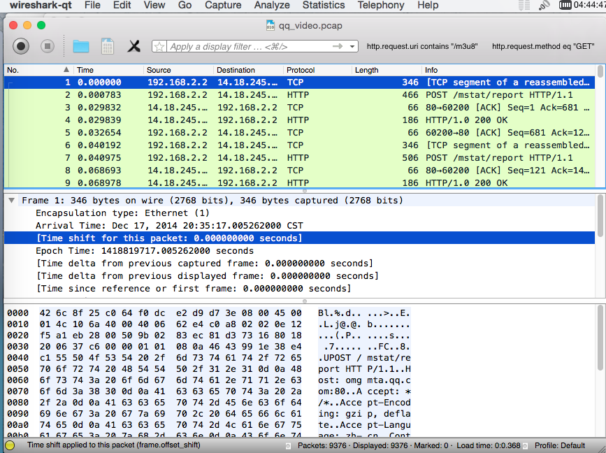

### 前述
`wireshark`作为分析网络报文的利器，我在此就不做多少介绍。其作为一个跨平台的软件，在`Mac`下也是支持的，不过官方发布的是`gtk+`版，界面实在太丑，还有一点它启动时还要`X`环境的支持，你需要去下个`XQuartz`来支持，实在是太麻烦，使用它纯属无奈。一个偶然的机会在网上看`Mac`可装`QT`版，果断尝试了下，发现还是蛮不错的，这里就记录下安装过程。
### 前期准备
在你的`OSX`环境下需要能使用 `brew` 命令，如果没有，请参照[官方网站](http://brew.sh)安装。
顺便给大家一个效果图，这样动起手来可能会更有点动力。

### 动手
输入`brew options wireshark` 可以查看安装 `wireshark`时都有哪些选项。

* 如果你之前没有安装 `wireshark`，请执行
	```
	brew install wireshark --with-qt
	```
* 如果你已经安装过`wireshark`了，请执行
	```
	brew reinstall wireshark --with-qt
	```
